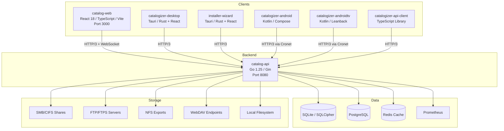
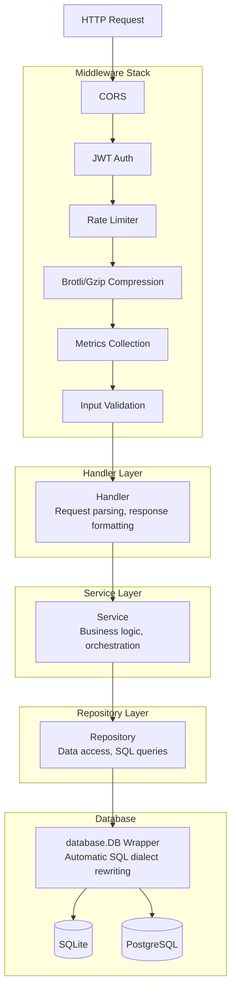
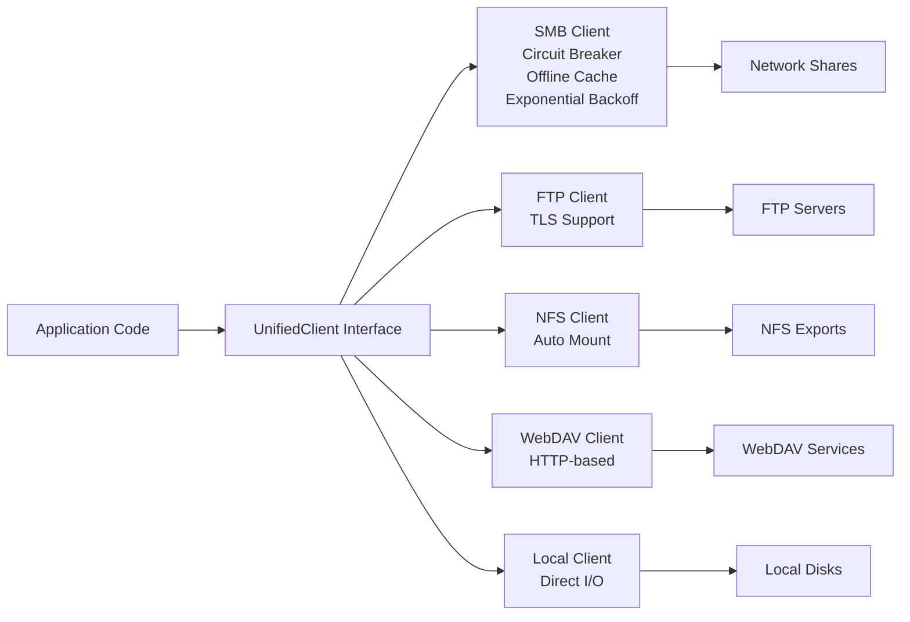
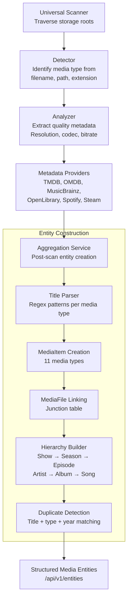
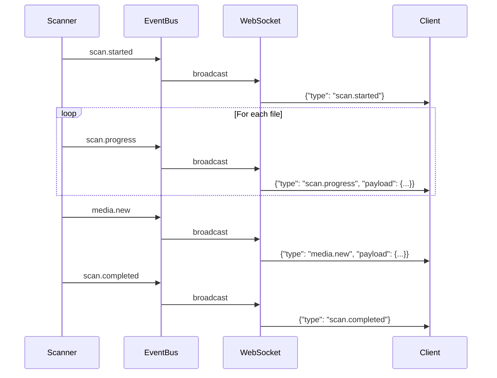
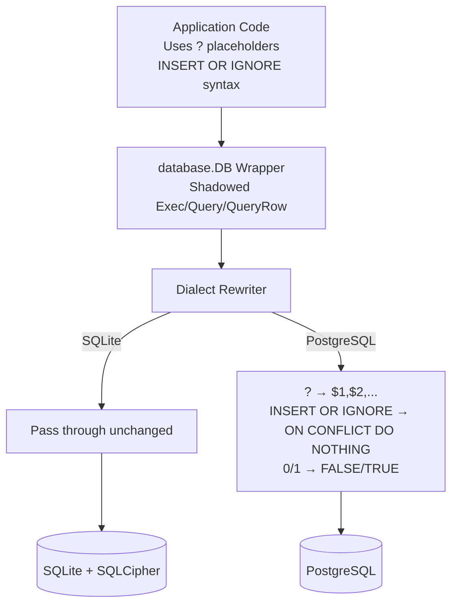
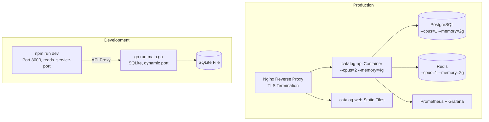

# System Architecture

Catalogizer is composed of seven application components that share a common Go backend. This page provides a high-level view of how the components connect, how data flows through the system, and how the modular architecture enables multi-protocol media management.

---

## Component Topology

Seven components form the Catalogizer ecosystem. All clients communicate with the backend over HTTP/3 (QUIC) with Brotli compression, falling back to HTTP/2 + gzip when HTTP/3 is unavailable.

### Component Summary

| Component | Technology | Purpose |
|-----------|-----------|---------|
| **catalog-api** | Go 1.25, Gin | REST API backend, media detection, storage protocol abstraction, challenge runner |
| **catalog-web** | React 18, TypeScript, Vite | Web frontend with real-time updates via WebSocket |
| **catalogizer-desktop** | Tauri (Rust + React) | Cross-platform desktop app for Windows, macOS, Linux |
| **installer-wizard** | Tauri (Rust + React) | First-time setup wizard with network discovery |
| **catalogizer-android** | Kotlin, Jetpack Compose | Android phone/tablet app with offline-first architecture |
| **catalogizer-androidtv** | Kotlin, Leanback | Android TV app with D-PAD navigation and home screen channels |
| **catalogizer-api-client** | TypeScript | Reusable typed API client library |

---

## Backend Layered Architecture

The backend follows a strict Handler-Service-Repository layered architecture with dependency injection throughout.

### Dual Package Layout

The backend uses two package trees to separate domain logic from infrastructure:

| Package Tree | Scope | Examples |
|---|---|---|
| **Top-level** (`handlers/`, `services/`, `repository/`, `middleware/`) | Domain logic | Media entities, collections, favorites, playback, search |
| **Internal** (`internal/handlers/`, `internal/services/`, `internal/middleware/`) | Infrastructure | Auth, metrics, WebSocket, cache, media detection pipeline, SMB circuit breaker |

This separation keeps infrastructure concerns isolated from business rules, making each layer independently testable.

---

## Multi-Protocol Filesystem Abstraction

All storage access goes through a `UnifiedClient` interface defined in `filesystem/interface.go`. A factory in `filesystem/factory.go` creates the appropriate client based on protocol type. The rest of the application is protocol-agnostic.

The interface supports standard filesystem operations: list directories, read files, get file info, copy, and delete. The `SeekableClient` extension enables HTTP Range requests for video seeking on protocols that support random-access reads (SMB, local).

Adding a new protocol requires implementing the `UnifiedClient` interface and registering the protocol in the factory. No application-level changes are needed.

---

## Media Detection Pipeline

Scanned files pass through a multi-stage detection pipeline that identifies, analyzes, enriches, and structures media entities.

### Supported Media Types

The system recognizes 11 media types, seeded in the `media_types` table:

| Type | Hierarchy | Example |
|------|-----------|---------|
| movie | Standalone | "Inception (2010)" |
| tv_show | Parent of tv_season | "Breaking Bad" |
| tv_season | Child of tv_show, parent of tv_episode | "Season 1" |
| tv_episode | Child of tv_season | "S01E01 - Pilot" |
| music_artist | Parent of music_album | "Pink Floyd" |
| music_album | Child of music_artist, parent of song | "The Dark Side of the Moon" |
| song | Child of music_album | "Time" |
| game | Standalone | "The Witcher 3" |
| software | Standalone | "Blender 4.0" |
| book | Standalone | "Dune" |
| comic | Standalone | "Saga Vol. 1" |

---

## Real-Time Event System

The backend publishes events through an internal event bus that routes them to WebSocket connections. Clients receive live updates without polling.

Events include scan progress, new media detection, source connection/disconnection, format conversion progress, and collection changes.

---

## Submodule Architecture

The project uses 41 independent git submodules under the vasic-digital organization. Each submodule is a standalone repository with its own tests, documentation, and ARCHITECTURE.md.

### Go Modules (22 total)

Go submodules are wired via `replace` directives in `catalog-api/go.mod`. This allows the backend to import them by their canonical module paths while resolving to local filesystem paths during development.

Key modules include Auth (JWT authentication), Database (dual-dialect abstraction), Filesystem (protocol clients), Media (detection pipeline), Cache (Redis/in-memory), EventBus (pub/sub), RateLimiter (sliding window), Security (input validation), Observability (metrics/logging), and Challenges (test framework).

### TypeScript Modules (9 total)

TypeScript submodules are linked via `file:../` references in `package.json`. They include WebSocket-Client (React hooks), UI-Components (shared component library), Media-Types (type definitions), Auth-Context (authentication provider), Media-Browser, Media-Player, Collection-Manager, Dashboard-Analytics, and the API Client.

---

## Database Architecture

The dual-dialect abstraction in `database/dialect.go` allows the same application code to run against SQLite (development) and PostgreSQL (production) without query changes.

Migrations live in `database/migrations/` with separate implementations for each dialect. The `InsertReturningID()` helper abstracts the difference between SQLite's `LastInsertId()` and PostgreSQL's `RETURNING id`.

---

## Deployment Topology

All containers run with resource limits enforced (max 4 CPUs, 8 GB RAM total). The container runtime is Podman (rootless), with dynamic detection supporting Docker or nerdctl as alternatives.
