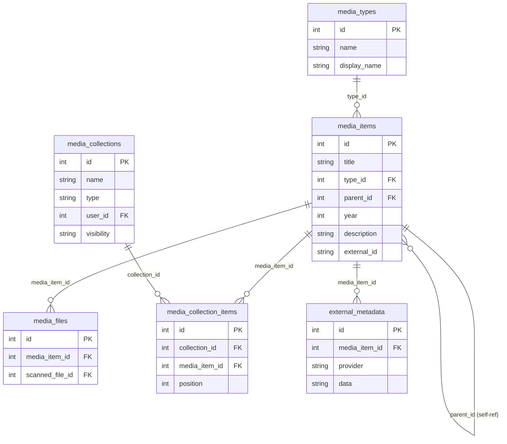

# Database Architecture

Catalogizer supports two database backends through a dialect abstraction layer: SQLite for development and PostgreSQL for production. Application code writes SQL once using SQLite syntax, and the dialect layer rewrites it transparently for PostgreSQL when needed.

---

## Dialect Abstraction

The core abstraction lives in `catalog-api/database/dialect.go`. A `Dialect` struct identifies the active backend and provides rewriting methods.

### SQL Rewriting

| SQLite Syntax | PostgreSQL Rewrite | Method |
|---|---|---|
| `?` placeholders | `$1, $2, $3, ...` | `RewritePlaceholders()` |
| `INSERT OR IGNORE INTO ...` | `INSERT INTO ... ON CONFLICT DO NOTHING` | `RewriteInsertOrIgnore()` |
| `INSERT OR REPLACE INTO ...` | `INSERT INTO ...` (caller adds conflict clause) | `RewriteInsertOrReplace()` |
| `= 0` / `= 1` for booleans | `= FALSE` / `= TRUE` | `BooleanLiterals()` |

### database.DB Wrapper

The `database.DB` type wraps Go's `*sql.DB` with shadowed `Exec()`, `Query()`, and `QueryRow()` methods. These apply dialect rewrites before executing, so calling code never deals with dialect differences directly.

```go
// Application code writes SQLite-style SQL everywhere
rows, err := db.Query(
    "SELECT id, title FROM media_items WHERE is_favorite = ? AND type = ?",
    1, "movie",
)
```

When running against PostgreSQL, this query is automatically rewritten to:

```sql
SELECT id, title FROM media_items WHERE is_favorite = TRUE AND type = $1
```

### InsertReturningID

SQLite and PostgreSQL differ in how they return the ID of a newly inserted row. `InsertReturningID()` and `TxInsertReturningID()` abstract this:

- **SQLite**: Executes the insert, then calls `result.LastInsertId()`
- **PostgreSQL**: Appends `RETURNING id` to the query and scans the result

```go
id, err := db.InsertReturningID(
    "INSERT INTO media_items (title, type) VALUES (?, ?)",
    "Inception", "movie",
)
```

Always use `InsertReturningID()` instead of `LastInsertId()` for cross-dialect compatibility.

---

## Connection Management

Connection setup lives in `catalog-api/database/connection.go`.

### Connection Pool Defaults

| Setting | Value |
|---------|-------|
| MaxOpenConns | 25 |
| MaxIdleConns | 10 |
| ConnMaxLifetime | 5 minutes |
| ConnMaxIdleTime | 3 minutes |

These defaults are overridable via configuration.

### SQLite WAL Mode

After opening an SQLite connection, the code explicitly executes `PRAGMA journal_mode=WAL`. This is necessary because `go-sqlcipher` ignores WAL pragma in the connection string. WAL mode enables concurrent reads during writes, which is critical for scan operations that read and write simultaneously.

### SQLCipher Encryption

SQLite databases can be encrypted at rest using SQLCipher (AES-256-CBC). Set `DB_ENCRYPTION_KEY` (exactly 32 characters) to enable encryption. The key is applied via `PRAGMA key` immediately after opening the connection.

### PostgreSQL

For PostgreSQL, set environment variables:

| Variable | Description |
|----------|-------------|
| `DB_TYPE` | Set to `postgres` |
| `DB_HOST` | Database hostname |
| `DB_PORT` | Database port (default 5432, mapped to 5433 in containers) |
| `DB_NAME` | Database name |
| `DB_USER` | Database user |
| `DB_PASSWORD` | Database password |

---

## Migrations

Migrations live in `catalog-api/database/migrations/` with separate implementations for each dialect:

- `migrations_sqlite.go` -- SQLite-specific DDL
- `migrations_postgres.go` -- PostgreSQL-specific DDL

Each migration is a versioned function registered in a migration list. The migrator runs them sequentially, tracking the current version in a `schema_migrations` table.

### Migration Parity

A boot-time test (`TestRunMigrationsSQLite`) verifies that every migration has both a SQLite and PostgreSQL implementation. This prevents dialect gaps from reaching production.

### Writing Migrations

1. Add migration functions in both `migrations_sqlite.go` and `migrations_postgres.go`
2. Register them in the migration list with the next version number
3. Test with SQLite (unit tests using `database.WrapDB()`) and PostgreSQL (integration tests)

Key differences to account for:

| Feature | SQLite | PostgreSQL |
|---------|--------|------------|
| Auto-increment | `INTEGER PRIMARY KEY AUTOINCREMENT` | `SERIAL` or `BIGSERIAL` |
| Boolean type | `INTEGER` (0/1) | `BOOLEAN` |
| DateTime | `TEXT` or `DATETIME` | `TIMESTAMP WITH TIME ZONE` |
| String length | No enforcement | `VARCHAR(n)` |

---

## Entity Tables

The media entity system uses the following table structure:



The `media_items` table uses a self-referencing `parent_id` foreign key to build hierarchies: TV shows contain seasons, seasons contain episodes; music artists contain albums, albums contain songs.

---

## Test Database

Unit tests use in-memory SQLite via `database.WrapDB()`:

```go
func TestRepository(t *testing.T) {
    sqlDB, err := sql.Open("sqlite3", ":memory:")
    require.NoError(t, err)
    defer sqlDB.Close()

    db := database.WrapDB(sqlDB, database.DialectSQLite)
    // Run migrations against db, then test repository methods
}
```

The test helper at `catalog-api/internal/tests/test_helper.go` provides convenience functions for setting up test databases with migrations pre-applied.
