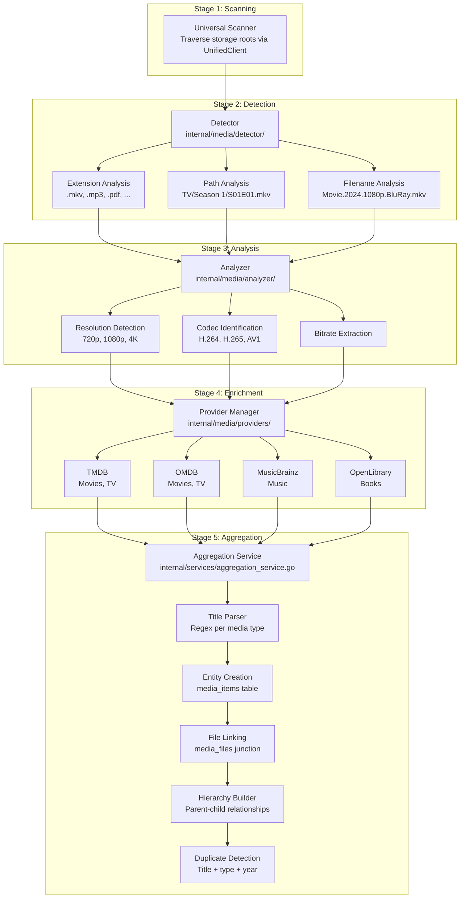
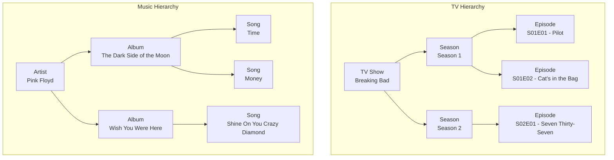

# Media Detection Pipeline

The media detection pipeline transforms raw files on storage into structured, enriched media entities. It operates as a post-scan process, taking file listings from the Universal Scanner and producing categorized entities with metadata from external providers.

---

## Pipeline Stages

---

## Stage 1: Scanning

The Universal Scanner traverses each configured storage root using the `UnifiedClient` interface. It recursively lists directories, collects file metadata (name, path, size, modification time), and passes the results to the detection stage.

Scanning is initiated via `POST /api/v1/scans/start` or triggered automatically based on configured schedules. Progress is broadcast over WebSocket with `scan.started`, `scan.progress`, and `scan.completed` events.

---

## Stage 2: Detection

The detector in `internal/media/detector/` identifies what type of media each file represents. It uses three analysis strategies:

### Extension Analysis

File extensions map to media type categories:

| Extensions | Media Type |
|-----------|------------|
| `.mkv`, `.mp4`, `.avi`, `.mov`, `.wmv` | Video (movie or TV episode) |
| `.mp3`, `.flac`, `.wav`, `.aac`, `.ogg` | Audio (song) |
| `.pdf`, `.epub`, `.mobi` | Book |
| `.cbr`, `.cbz`, `.cb7` | Comic |
| `.exe`, `.msi`, `.dmg`, `.iso` | Software |

### Path Analysis

Directory structure provides context for hierarchical media:

- `TV Shows/Breaking Bad/Season 1/S01E01.mkv` -- identified as a TV episode with show, season, and episode numbers extracted
- `Music/Pink Floyd/The Dark Side of the Moon/03 - Time.flac` -- identified as a song with artist and album extracted
- `Games/The Witcher 3/` -- identified as a game

### Filename Analysis

Regex patterns extract structured information from filenames:

- `Movie.Title.2024.1080p.BluRay.x264.mkv` -- movie with title, year, resolution, source, and codec
- `S01E01.Pilot.720p.HDTV.mkv` -- TV episode with season/episode numbers and title
- `Artist - Album - 01 - Track.mp3` -- song with artist, album, and track number

---

## Stage 3: Analysis

The analyzer in `internal/media/analyzer/` extracts quality metadata from detected media files:

| Metadata | Description | Example |
|----------|-------------|---------|
| Resolution | Video resolution | 1920x1080 (1080p) |
| Codec | Video/audio codec | H.265, AAC |
| Bitrate | Data rate | 8000 kbps |
| Container | File format | Matroska, MP4 |
| Duration | Runtime | 2h 28m |
| Channels | Audio channels | 5.1, 7.1, Stereo |

Quality metadata is stored alongside the scanned file record and used for quality badges in the UI (720p, 1080p, 4K), quality-based filtering, and duplicate resolution (prefer higher quality).

---

## Stage 4: Enrichment

The provider manager in `internal/media/providers/` fetches external metadata to enrich detected media. Providers are queried based on media type:

| Provider | Media Types | Data Retrieved |
|----------|------------|----------------|
| **TMDB** | Movies, TV shows | Title, description, poster, backdrop, cast, crew, genres, rating, release date |
| **OMDB** | Movies, TV shows | Ratings (IMDB, Rotten Tomatoes, Metacritic), plot, awards |
| **MusicBrainz** | Music (artists, albums, songs) | Artist info, album details, track listings, release dates |
| **OpenLibrary** | Books | Author, publisher, ISBN, cover art, page count, subjects |

### Graceful Degradation

Missing API keys or unavailable providers never block the pipeline. When a provider is unavailable:

- The pipeline continues with data from available providers
- Entities are created with whatever metadata is available
- Users can manually trigger metadata refresh later via `POST /api/v1/media/:id/refresh-metadata`

Additional providers (IGDB, GiantBomb, Spotify, Steam, Last.fm, iTunes, Discogs) are supported for specific media types and degrade gracefully when API keys are not configured.

### Cover Art

Cover art is fetched from multiple sources:

- **Movies/TV**: TMDB poster and backdrop images
- **Music**: MusicBrainz cover art archive, Last.fm, Spotify, iTunes, Discogs
- **Books**: OpenLibrary covers
- **Games**: Provider-specific artwork

Cover art is cached locally and served via `GET /api/v1/assets/by-entity/:type/:id`.

---

## Stage 5: Aggregation

The aggregation service in `internal/services/aggregation_service.go` runs as a post-scan hook via `AggregateAfterScan()`. It transforms detected files into structured media entities.

### Title Parser

The title parser in `internal/services/title_parser.go` uses regex patterns specific to each media type to extract structured information from filenames:

- **Movies**: Title, year, quality indicators
- **TV**: Show name, season number, episode number, episode title
- **Music**: Artist, album, track number, track title
- **Games**: Title, version
- **Software**: Name, version, platform

### Entity Creation

Parsed data maps to rows in the `media_items` table. Each entity has a type (from the 11 seeded `media_types`), a title, an optional year, and an optional parent reference.

### File Linking

The `media_files` junction table connects media items to their underlying scanned files. A single media item can have multiple files (different quality versions of the same movie, for example), and the same file can be associated with one entity.

### Hierarchy Builder

Parent-child relationships are built automatically based on media type:

The hierarchy builder uses the `parent_id` self-referencing foreign key in `media_items`. It creates parent entities (shows, artists) when they do not exist, then links child entities (seasons, albums, episodes, songs) to the appropriate parent.

### Duplicate Detection

After creating entities, the aggregation service checks for duplicates using title, type, and year matching. Duplicates across different storage sources are flagged so users can consolidate their libraries.

---

## API Endpoints

The entity system is exposed through the REST API:

| Method | Endpoint | Description |
|--------|----------|-------------|
| GET | `/api/v1/entities` | List entities with type, search, and pagination filters |
| GET | `/api/v1/entities/:id` | Get entity details with metadata and files |
| GET | `/api/v1/entities/:id/children` | Get child entities (seasons of a show, songs of an album) |
| GET | `/api/v1/entities/search` | Search entities by query string |
| GET | `/api/v1/entities/types` | List available media types |
| POST | `/api/v1/media/:id/analyze` | Trigger quality analysis for a specific item |
| POST | `/api/v1/media/:id/refresh-metadata` | Re-fetch external metadata from providers |
| GET | `/api/v1/media/popular` | Media sorted by favorites count |
| GET | `/api/v1/media/recent` | Recently discovered media |

---

## Real-Time Events

The pipeline broadcasts events during scanning and aggregation:

| Event | When | Payload |
|-------|------|---------|
| `scan.started` | Scan begins | Storage root ID |
| `scan.progress` | Each file processed | File count, percentage, current file |
| `media.new` | New entity created | Entity ID, title, type |
| `media.updated` | Metadata enriched | Entity ID, updated fields |
| `scan.completed` | Scan finishes | Total files, new entities, duration |

Clients receive these events over the WebSocket connection at `/ws` and can update their UI in real time without polling.
