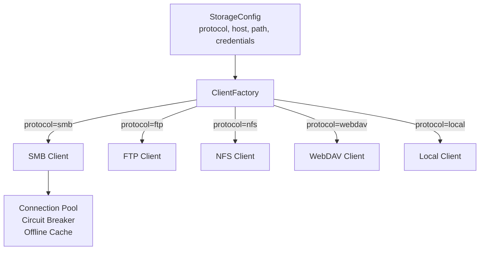
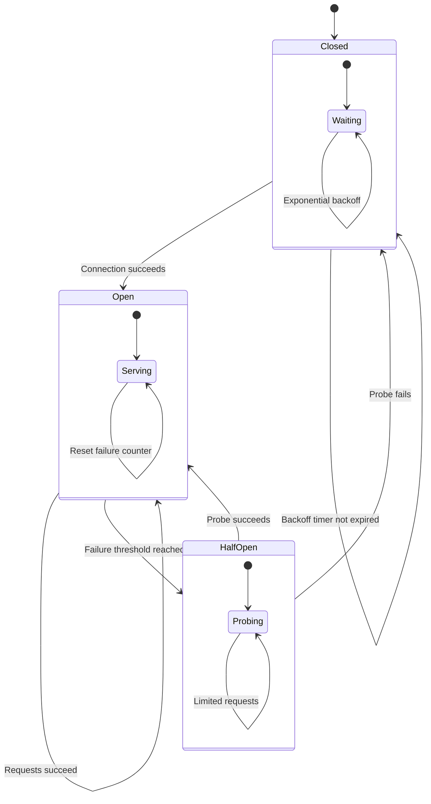

# Filesystem Protocols

Catalogizer connects to media stored across multiple network and local storage protocols through a unified abstraction. This page covers the `UnifiedClient` interface, supported protocols, connection resilience patterns, and how to extend support for additional protocols.

---

## UnifiedClient Interface

The `UnifiedClient` interface is defined in `catalog-api/filesystem/interface.go` (type alias to `digital.vasic.filesystem/pkg/client.Client`). It provides a protocol-agnostic API for all filesystem operations:

```go
type FileSystemClient interface {
    List(path string) ([]FileInfo, error)
    Read(path string) (io.ReadCloser, error)
    Stat(path string) (*FileInfo, error)
    Write(path string, reader io.Reader) error
    Delete(path string) error
    MkDir(path string) error
    Copy(op CopyOperation) (*CopyResult, error)
    Close() error
}
```

The `SeekableClient` extension adds random-access read support for protocols that support it (SMB, local filesystem):

```go
type SeekableClient interface {
    FileSystemClient
    OpenSeekable(path string) (ReadSeekCloser, error)
}
```

When a client implements `SeekableClient`, the stream handler can serve HTTP Range requests, enabling video seeking in the browser player.

---

## Supported Protocols

### SMB/CIFS

Windows and Samba file shares. The SMB client in `internal/smb/` includes connection resilience patterns:

- **Circuit breaker**: Prevents repeated connection attempts to downed servers. Configurable failure threshold, half-open probing interval, and state restoration from persistent storage.
- **Offline cache**: Serves previously loaded directory listings and metadata during storage outages, so users can continue browsing.
- **Exponential backoff retry**: Gradually increases delay between reconnection attempts to avoid overwhelming recovering servers.
- **Connection pool**: Managed pool with configurable limits, idle timeouts, and health checks. `StopCleanup()` waits for the cleanup goroutine to exit cleanly.
- **SMB discovery**: Auto-detects available SMB shares on the local network via the `/api/v1/smb/discover` endpoint.

### FTP/FTPS

Standard and TLS-secured File Transfer Protocol. Supports passive mode, directory listing, file download, and upload. FTPS adds TLS encryption for the control and data channels.

### NFS

Network File System with automatic mount handling. Reads and writes operate on the mounted export path. NFS is typically used for Linux-to-Linux media storage.

### WebDAV

HTTP-based file access for web storage services. Uses standard HTTP methods (GET, PUT, DELETE, PROPFIND) for file operations. Supports both HTTP and HTTPS endpoints with configurable authentication.

### Local Filesystem

Direct access to locally attached storage. The local client implements both `FileSystemClient` and `SeekableClient`, providing full random-access read support for video streaming.

---

## Factory Pattern

`filesystem/factory.go` creates the appropriate client based on the protocol specified in the storage root configuration:



Application code never references protocol-specific types. It receives a `FileSystemClient` from the factory and interacts with it through the interface.

---

## Storage Root Configuration

Storage sources are managed through the REST API at `/api/v1/storage-roots`. Each storage root specifies:

| Field | Description |
|-------|-------------|
| `name` | Display name for the storage source |
| `protocol` | One of: `smb`, `ftp`, `nfs`, `webdav`, `local` |
| `host` | Server hostname or IP (not used for `local`) |
| `port` | Server port (protocol-specific defaults apply) |
| `path` | Share name, export path, or local directory |
| `username` | Authentication username (optional for some protocols) |
| `password` | Authentication password (optional for some protocols) |

The `POST /api/v1/storage-roots/:id/test` endpoint validates connectivity before saving.

---

## Connection Resilience

The SMB client provides the most complete resilience implementation, which serves as the pattern for other protocol clients:



### Resilience Settings

| Setting | Default | Description |
|---------|---------|-------------|
| Failure threshold | 5 | Consecutive failures before circuit opens |
| Reset timeout | 30s | Time before trying a half-open probe |
| Max backoff | 5m | Maximum delay between retry attempts |
| Pool max connections | 10 | Maximum concurrent connections per storage root |
| Pool idle timeout | 5m | How long idle connections are kept alive |
| Health check interval | 30s | How often idle connections are validated |

---

## Scanning Integration

The Universal Scanner traverses storage roots using the `UnifiedClient` interface:

1. The scanner calls `List()` recursively on each storage root
2. For each file, `Stat()` retrieves size and modification time
3. File metadata is passed to the media detection pipeline (detector, analyzer, providers)
4. Results are stored in the database and broadcast via WebSocket events

During scanning, the connection pool manages concurrent access to the same storage source. The semaphore-based concurrency control in `internal/concurrency/` prevents resource exhaustion on large libraries.

---

## Extending with New Protocols

To add support for a new storage protocol:

1. **Implement `FileSystemClient`**: Create a new client type that implements all methods of the interface (List, Read, Stat, Write, Delete, MkDir, Copy, Close)
2. **Optionally implement `SeekableClient`**: If the protocol supports random-access reads, implement `OpenSeekable()` for video streaming support
3. **Register in the factory**: Add a case for the new protocol string in `filesystem/factory.go`
4. **Add connection resilience**: Implement circuit breaker and retry patterns following the SMB client as a reference
5. **Write tests**: Unit tests with mock servers and integration tests with real protocol endpoints

No changes to the scanner, detection pipeline, or API handlers are required. The factory pattern ensures new protocols are automatically available throughout the application.
