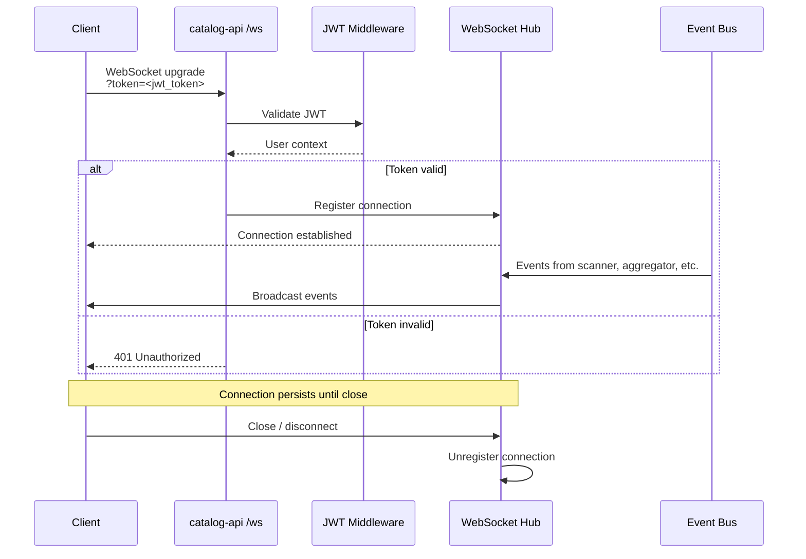
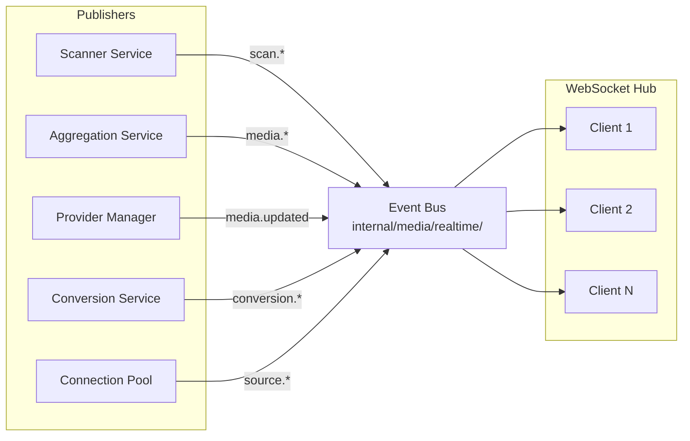

# WebSocket Real-Time Events

Catalogizer uses WebSocket connections to push real-time events from the backend to all connected clients. This page covers the connection lifecycle, available event types, client integration patterns, and the concurrency safety mechanisms that underpin the system.

---

## Connection Lifecycle



### Connecting

Connect to `/ws` with a valid JWT token as a query parameter:

```javascript
const ws = new WebSocket('ws://localhost:8080/ws?token=<jwt_token>');

ws.onopen = () => {
  console.log('Connected to Catalogizer events');
};

ws.onmessage = (event) => {
  const data = JSON.parse(event.data);
  console.log(data.type, data.payload);
};

ws.onclose = (event) => {
  console.log('Disconnected:', event.code, event.reason);
};
```

The token is validated by the JWT middleware before the WebSocket upgrade completes. Connections with invalid or expired tokens are rejected with a `401 Unauthorized` response.

### Automatic Reconnection

The frontend `@vasic-digital/websocket-client` module provides React hooks with built-in reconnection logic:

```typescript
import { useWebSocket } from '@vasic-digital/websocket-client';

function ScanProgress() {
  const { lastMessage, readyState } = useWebSocket('/ws', {
    queryParams: { token: accessToken },
    shouldReconnect: true,
    reconnectInterval: 3000,
    reconnectAttempts: 10,
  });

  // Handle messages...
}
```

The connection indicator in the web app's bottom corner shows the current WebSocket status and reconnects automatically if the connection drops.

---

## Event Types

All events follow a consistent JSON format:

```json
{
  "type": "event.name",
  "payload": { ... },
  "timestamp": "2026-04-14T12:00:00Z"
}
```

### Scan Events

| Event | Description | Payload |
|-------|-------------|---------|
| `scan.started` | A scan has begun | `{ "root_id": 1, "root_name": "NAS Media" }` |
| `scan.progress` | Scan progress update | `{ "root_id": 1, "files_scanned": 1250, "total_estimate": 85000, "percent": 1.47, "current_file": "/movies/..." }` |
| `scan.completed` | A scan has finished | `{ "root_id": 1, "files_scanned": 85000, "new_items": 42, "duration_ms": 1500000 }` |

### Media Events

| Event | Description | Payload |
|-------|-------------|---------|
| `media.new` | New media entity detected | `{ "id": 123, "title": "Inception", "type": "movie", "year": 2010 }` |
| `media.updated` | Media metadata updated | `{ "id": 123, "updated_fields": ["description", "poster_url"] }` |

### Source Events

| Event | Description | Payload |
|-------|-------------|---------|
| `source.connected` | Storage source connected | `{ "root_id": 1, "protocol": "smb" }` |
| `source.disconnected` | Storage source went offline | `{ "root_id": 1, "error": "connection refused" }` |
| `source.recovered` | Storage source reconnected | `{ "root_id": 1, "downtime_ms": 45000 }` |

### Conversion Events

| Event | Description | Payload |
|-------|-------------|---------|
| `conversion.progress` | Format conversion progress | `{ "id": "conv-1", "percent": 65, "eta_seconds": 120 }` |
| `conversion.completed` | Format conversion finished | `{ "id": "conv-1", "output_path": "/converted/..." }` |

---

## Architecture

### Event Bus

The event bus in `internal/media/realtime/` is the central hub for all real-time events. Backend services publish events to the bus, and the WebSocket handler subscribes to broadcast them to connected clients.



### WebSocket Handler

The `WebSocketHandler` manages the lifecycle of all WebSocket connections:

- **Connection registration**: New connections are registered in the hub with a unique client ID
- **Read pump**: Each connection has a goroutine that reads incoming messages (ping/pong, close frames)
- **Write pump**: Events from the event bus are serialized to JSON and written to all registered connections
- **Cleanup goroutine**: Periodically removes stale connections that have not responded to ping frames

### Concurrency Safety

The WebSocket handler uses several concurrency safety patterns:

- **Mutex-protected connection count**: `connCount` reads are protected by a mutex to prevent data races during concurrent connect/disconnect operations
- **`sync.Once` for cleanup**: The `Stop()` method uses `sync.Once` to ensure the cleanup goroutine is stopped exactly once, even if `Stop()` is called multiple times
- **Non-blocking sends**: Log stream sends use `select` with a timeout to prevent blocking when a client's send buffer is full. If the send cannot complete within the timeout, the message is dropped rather than blocking the event bus.
- **Connection lifecycle ordering**: In production shutdown, `main.go` calls `wsHandler.Stop()` before `server.Close()` to cleanly unblock read pumps

### Test Patterns

Tests involving the WebSocket handler must follow these patterns:

```go
func TestWebSocket(t *testing.T) {
    handler := NewWebSocketHandler(eventBus)

    // Start test server
    server := httptest.NewServer(handler)

    // Tests...

    // Cleanup: stop handler BEFORE closing server
    handler.Stop()
    server.Close()
}
```

Calling `handler.Stop()` before `server.Close()` is critical. The stop signal unblocks the read pump goroutine, allowing the server to close cleanly. Reversing this order causes the test to hang.

---

## Client Integration

### React (catalog-web)

The web app wraps WebSocket connectivity in a provider at the top of the component tree:

```
AuthProvider → WebSocketProvider → Router → Pages
```

Components access real-time events through the WebSocket context:

```typescript
function Dashboard() {
  const { subscribe } = useWebSocketContext();

  useEffect(() => {
    const unsubscribe = subscribe('scan.progress', (payload) => {
      // Update progress bar
    });
    return unsubscribe;
  }, [subscribe]);
}
```

### Android

The Android app uses the `WebSocketRepository` to maintain a persistent connection with automatic reconnection:

```kotlin
class ScanViewModel @Inject constructor(
    private val webSocketRepo: WebSocketRepository
) : ViewModel() {
    val scanProgress = webSocketRepo.events
        .filter { it.type == "scan.progress" }
        .map { it.payload }
        .stateIn(viewModelScope, SharingStarted.Lazily, null)
}
```

### Android TV

The TV app receives the same WebSocket events as the phone app. Channel sync operations (updating home screen channel content) are triggered by `scan.completed` and `media.new` events in addition to the periodic WorkManager sync.

---

## Connection Health

The WebSocket implementation includes health monitoring:

- **Ping/pong**: The server sends periodic ping frames. Clients that do not respond with a pong within the timeout are considered disconnected and removed from the hub.
- **Stagnation detection**: If identical frames are received for more than 10 seconds, the connection is flagged for investigation.
- **Metrics**: Active connection count and message throughput are exposed via Prometheus at `/metrics`.

### Connection Limits

| Setting | Default | Description |
|---------|---------|-------------|
| Max connections | 100 | Maximum concurrent WebSocket connections |
| Ping interval | 30s | How often the server sends ping frames |
| Pong timeout | 10s | How long to wait for a pong response |
| Write buffer | 4 KB | Per-connection write buffer size |
| Read buffer | 4 KB | Per-connection read buffer size |
