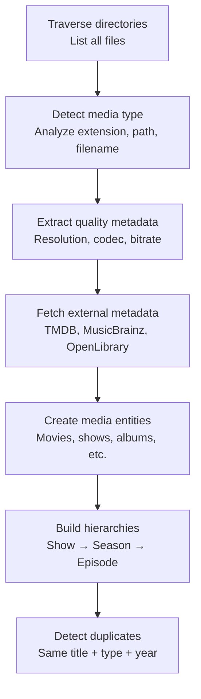

# First Scan

This guide walks you through adding a storage source to Catalogizer, running your first scan, and browsing the detected media. By the end, you will have a populated catalog with categorized media entities.

---

## Step 1: Add a Storage Source

Navigate to **Settings** in the sidebar, then click **Add Storage Source**. Choose the protocol that matches your media storage:

### Local Filesystem

The simplest option. Point Catalogizer at a directory on the machine where the backend is running.

1. Select **Local Filesystem** as the protocol
2. Enter the full path to your media directory (e.g., `/mnt/media` or `D:\Media`)
3. Give it a descriptive name (e.g., "Local Media")
4. Click **Test Connection** to verify the path exists and is readable
5. Click **Save**

### SMB/CIFS (Network Share)

For Windows file shares or Samba servers on your network.

1. Select **SMB/CIFS** as the protocol
2. Enter the server address (hostname or IP, e.g., `192.168.0.241` or `synology.local`)
3. Enter the share name (e.g., `Media`)
4. Enter username and password for the share
5. Click **Test Connection** -- the backend will attempt to connect and list the share
6. Click **Save**

If you are unsure which shares are available, use the **Discover Shares** button. Catalogizer will scan the local network for SMB shares via the `/api/v1/smb/discover` endpoint.

### FTP/FTPS

For FTP servers with optional TLS encryption.

1. Select **FTP** (or **FTPS** for TLS) as the protocol
2. Enter the server address and port (default: 21)
3. Enter the path on the server (e.g., `/media`)
4. Enter credentials
5. Test and save

### NFS

For Network File System exports.

1. Select **NFS** as the protocol
2. Enter the server address
3. Enter the export path (e.g., `/volume1/media`)
4. Test and save

### WebDAV

For HTTP-based file access (ownCloud, Nextcloud, etc.).

1. Select **WebDAV** as the protocol
2. Enter the full URL (e.g., `https://cloud.example.com/remote.php/dav/files/user/media`)
3. Enter credentials
4. Test and save

---

## Step 2: Run the Scan

After adding a storage source, you can trigger a scan in two ways:

### From the Dashboard

1. Navigate to the **Dashboard**
2. Click **Scan Now**
3. The scan starts immediately across all configured storage sources

### From Settings

1. In **Settings > Storage Sources**, find your newly added source
2. Click the **Scan** button next to it to scan only that source

### Monitoring Progress

Scan progress is displayed in real time through WebSocket events:

- A progress bar shows the percentage of files scanned
- The current file being processed is displayed
- A running count of detected files updates as the scan proceeds
- Toast notifications appear when new media entities are created

The scan runs in the background. You can continue using the interface while it progresses.

---

## Step 3: What Happens During a Scan

The scan processes your files through the media detection pipeline:

### Media Type Detection

Catalogizer recognizes 11 media types:

| Type | What Gets Detected |
|------|-------------------|
| **Movies** | Video files with movie-like naming patterns (Title.Year.Quality.mkv) |
| **TV Shows** | Directories with season/episode structure (S01E01, Season 1, etc.) |
| **TV Seasons** | Groupings within TV show directories |
| **TV Episodes** | Individual episode video files |
| **Music Artists** | Top-level music directories (Artist Name/) |
| **Music Albums** | Album directories within artist folders |
| **Songs** | Individual audio files (.mp3, .flac, .wav, etc.) |
| **Games** | Game directories and installers |
| **Software** | Application installers and disk images |
| **Books** | PDF, EPUB, and MOBI files |
| **Comics** | CBR, CBZ, and CB7 archives |

### Metadata Enrichment

If you have configured API keys for external providers (see [Configuration](/docs/getting-started/configuration)), the scan enriches your catalog with:

- **TMDB**: Movie and TV show descriptions, posters, backdrops, cast, genres, and ratings
- **OMDB**: Additional ratings from IMDB, Rotten Tomatoes, and Metacritic
- **MusicBrainz**: Artist information, album details, track listings, and release dates
- **OpenLibrary**: Author, publisher, ISBN, cover art, and page counts

Enrichment is optional. The catalog works without API keys, but media entries will have less metadata.

---

## Step 4: Browse Your Catalog

Once the scan completes, navigate to **Browse** in the sidebar to explore your media.

### View Modes

Toggle between three view modes using the icons in the top-right corner:

- **Grid**: Thumbnail cards with poster art, title, year, and quality badge
- **List**: Compact rows showing title, type, size, quality, and source
- **Detail**: Expanded cards with full metadata and description

### Filtering

Narrow results using the filter panel:

- **Media type**: Show only movies, TV shows, music, games, etc.
- **Quality**: Filter by resolution (720p, 1080p, 4K)
- **Source**: Show media from a specific storage source
- **Year**: Filter by release year range
- **Sort**: Order by title, date added, year, size, or quality

### Hierarchical Browsing

Media with parent-child relationships supports drill-down navigation:

- Click a **TV Show** to see its seasons
- Click a **Season** to browse episodes
- Click a **Music Artist** to see albums
- Click an **Album** to list songs

### Media Details

Click any media item to open its detail page:

- Poster and backdrop artwork
- Title, year, runtime, genres, rating
- Description from external providers
- List of associated files with size, codec, and storage location
- Play button to stream directly in the browser
- Actions to add to favorites, collections, or playlists

---

## Step 5: Play Media

Click the **Play** button on any media detail page to stream it in the built-in player:

- Transport controls: play, pause, seek, volume, fullscreen
- Subtitle selection from detected subtitle files
- Resume from last playback position
- Automatic advancement through playlists

The player streams directly from the storage source through the backend, regardless of which protocol the source uses.

---

## What's Next

With your catalog populated, explore these features:

- **[Search](/guides/web-app#search)**: Full-text search across titles, descriptions, and metadata
- **[Collections](/guides/web-app#collections)**: Organize media into Manual, Smart, or Dynamic collections
- **[Favorites](/guides/web-app#favorites)**: Bookmark items for quick access with JSON/CSV export
- **[Desktop App](/guides/desktop)**: Install the native desktop application
- **[Android App](/guides/android)**: Install the mobile app with offline support
- **[Android TV App](/guides/android-tv)**: Set up the living room experience with home screen channels
- **[Monitoring](/guides/monitoring)**: Configure Prometheus and Grafana for production deployments
