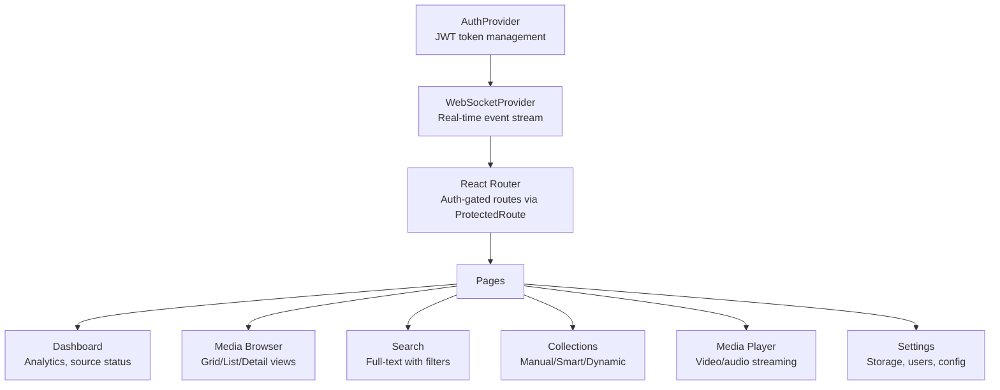
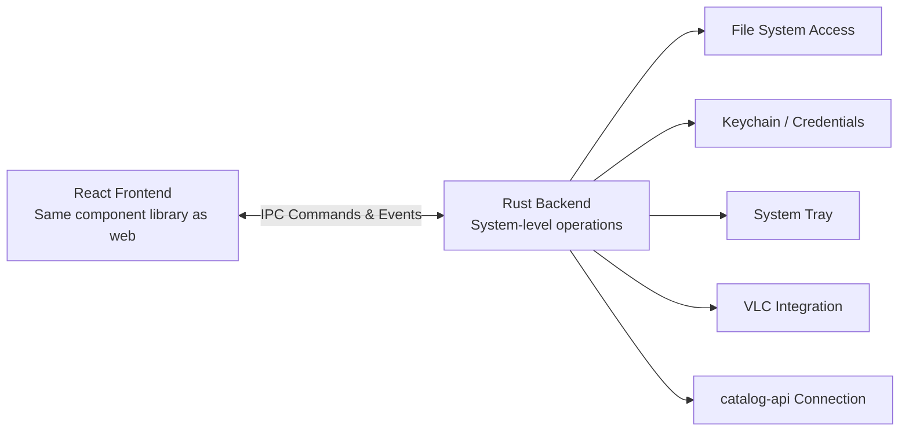
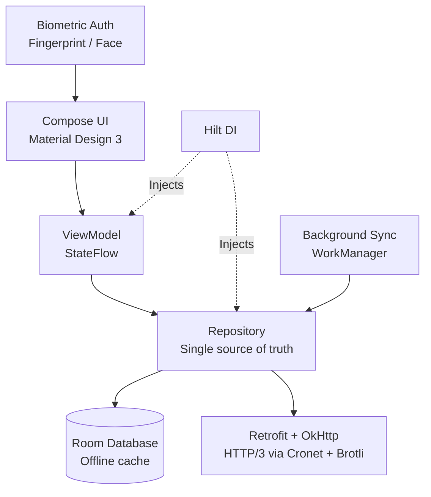
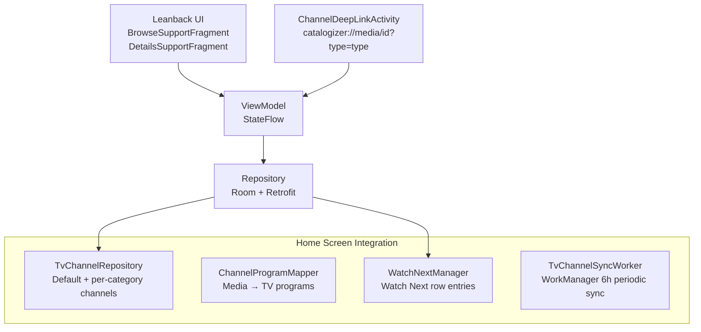

# Platforms

Catalogizer runs on four platforms, each tailored to its target environment while sharing the same backend API. This page covers the architecture, capabilities, and unique features of each platform.

---

## Web Application (catalog-web)

The web application is a React 18 single-page application built with TypeScript and Vite. It serves as the primary interface for browsing, searching, and managing media collections.

### Technology Stack

| Technology | Role |
|-----------|------|
| React 18 | Component framework |
| TypeScript | Type safety |
| Vite | Build tool and dev server |
| Tailwind CSS | Styling with `cn()` utility |
| React Query | Server state management |
| Zustand | Client state management |
| React Hook Form + Zod | Form handling and validation |
| Framer Motion | Animations and transitions |
| Vitest | Unit testing |
| Playwright | End-to-end testing |

### Architecture



### Key Features

- **Real-time updates**: WebSocket connection delivers scan progress, new media notifications, and source status changes without polling
- **Multiple view modes**: Grid (thumbnail cards), List (compact rows), and Detail (expanded metadata) for the media browser
- **API proxy**: The dev server reads `../catalog-api/.service-port` to automatically route API requests to the backend
- **Path aliases**: `@/components`, `@/hooks`, `@/lib`, `@/types`, `@/services`, `@/store`, `@/pages` for clean imports
- **Build optimization**: Production builds split into vendor, router, UI, charts, and utils chunks for optimal loading

### Development

```bash
cd catalog-web
npm install
npm run dev          # Dev server on port 3000
npm run build        # Production build (tsc + vite)
npm run test         # Vitest unit tests
npm run test:e2e     # Playwright end-to-end tests
npm run lint         # ESLint with --max-warnings 0
npm run type-check   # TypeScript noEmit check
```

---

## Desktop Application (catalogizer-desktop)

The desktop application is built with Tauri, combining a Rust backend with a React frontend through an IPC bridge. It provides a native experience on Windows, macOS, and Linux.

### Architecture



### Key Features

- **Native performance**: Rust-based backend for system operations, avoiding Electron's memory overhead
- **System tray integration**: Background operation with status indicator and quick actions
- **VLC media playback**: Integrated VLC player for local media playback
- **Keychain storage**: Secure credential storage using the operating system's native keychain
- **Cross-platform builds**: Single codebase produces installers for Windows (.msi), macOS (.dmg), and Linux (.AppImage, .deb, .rpm)

### Installation Wizard (installer-wizard)

The installation wizard is a separate Tauri application that guides first-time users through setup:

- **Network discovery**: Automatic SMB share detection on the local network
- **Connection testing**: Real-time validation of storage source connectivity
- **Configuration export**: Generates configuration files for the main application
- **Visual setup**: Step-by-step guided interface for database, storage, and account configuration

### Development

```bash
cd catalogizer-desktop   # or installer-wizard
npm run tauri:dev        # Development mode with hot reload
npm run tauri:build      # Production build with platform installer
```

---

## Android Application (catalogizer-android)

The Android app follows MVVM architecture with Jetpack Compose for the UI layer. It provides an offline-first experience with automatic background synchronization.

### Architecture



### Key Features

- **Offline-first**: Room database caches the full catalog for browsing without network connectivity. Changes sync automatically when connectivity is restored.
- **Biometric authentication**: Fingerprint and face unlock on supported devices for secure app access
- **HTTP/3 transport**: OkHttp with Cronet provides HTTP/3 (QUIC) and Brotli compression for efficient network usage
- **Background sync**: WorkManager handles periodic catalog synchronization respecting battery and network constraints
- **WebSocket real-time updates**: Live scan progress, new media notifications, and source status changes pushed to the app
- **Configurable caching**: Wi-Fi-only sync and storage limit options for bandwidth and space management
- **Material Design 3**: Full Material You theming with dynamic colors on supported devices

### Development

```bash
cd catalogizer-android
./gradlew assembleDebug                                # Build debug APK
./gradlew test                                         # All unit tests
./gradlew :app:testDebugUnitTest --tests ClassName     # Single test class
```

---

## Android TV Application (catalogizer-androidtv)

The Android TV app is purpose-built for the 10-foot experience with Leanback UI, D-PAD navigation, and deep integration with Android TV's home screen channels.

### Architecture

The TV app shares the MVVM foundation with the phone app but uses the Leanback library for TV-optimized layouts and navigation:



### Home Screen Channels

The TV app integrates with Android TV's home screen through `androidx.tvprovider`:

- **Default channel**: "Catalogizer Picks" auto-created on first launch with curated content
- **Per-category channels**: Dynamic channels for each media type (Movies, TV Shows, Music, etc.)
- **Watch Next row**: Partially-watched items appear in the system Watch Next row for resume playback. Auto-next-episode adds the next unwatched episode when one finishes.
- **Deep linking**: Content launched from home screen channels uses `catalogizer://media/{id}?type={type}` URIs with per-category launch behavior configurable in Settings
- **Background sync**: WorkManager runs 6-hour periodic sync to keep channels current, with additional triggers on app launch and manual sync

### Key Features

- **D-PAD navigation**: Full remote control support with focus management optimized for directional navigation
- **Google Assistant**: Voice search integration for finding media by title or genre
- **10-foot UI**: Leanback layouts with large text, high-contrast visuals, and overscan-safe margins
- **Lean browsing**: Header-based category browsing with horizontal content rows

### Development

```bash
cd catalogizer-androidtv
./gradlew assembleDebug                                # Build debug APK
./gradlew test                                         # All unit tests
```

---

## TypeScript API Client (catalogizer-api-client)

The API client is a typed TypeScript library for integrating Catalogizer into other applications. It handles authentication, request formatting, and response parsing.

- Media search, metadata retrieval, and source management
- Typed responses matching the backend API contract
- Publishable as an npm package or usable via local `file:../` linking

```bash
cd catalogizer-api-client
npm run build
npm run test
```

---

## Cross-Platform Shared Modules

Nine TypeScript submodules are shared across web and desktop clients via `file:../` references:

| Module | Purpose |
|--------|---------|
| `@vasic-digital/websocket-client` | WebSocket client with React hooks for real-time events |
| `@vasic-digital/ui-components` | Shared React component library |
| `@vasic-digital/media-types` | Shared media type definitions |
| `@vasic-digital/auth-context` | Authentication context provider |
| `@vasic-digital/media-browser` | Media browsing components |
| `@vasic-digital/media-player` | Playback components |
| `@vasic-digital/collection-manager` | Collection management UI |
| `@vasic-digital/dashboard-analytics` | Dashboard and analytics components |
| `@vasic-digital/catalogizer-api-client` | Typed API client |

This module sharing ensures consistent behavior and appearance across the web and desktop platforms while allowing each to extend functionality for its target environment.
