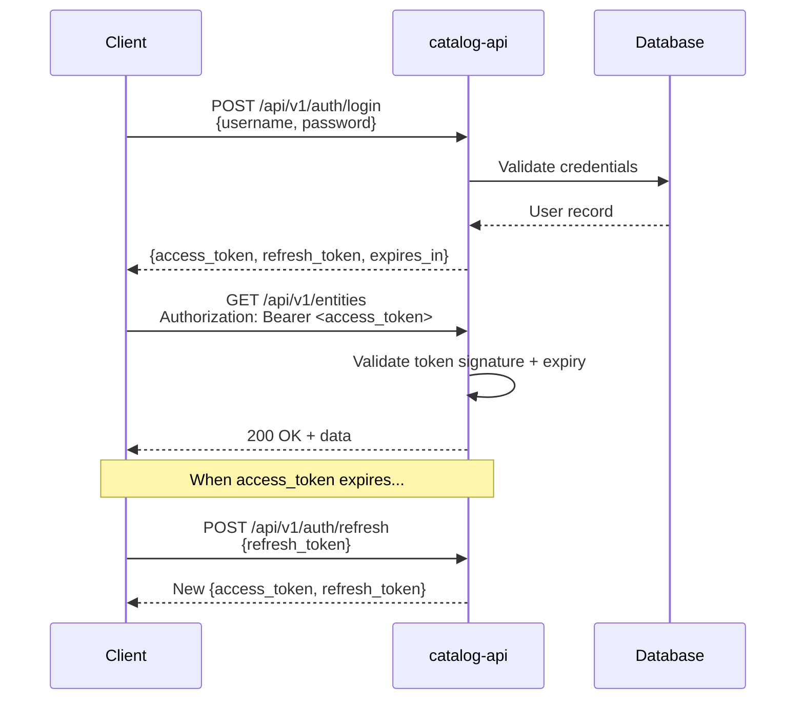

# Security

Catalogizer implements defense-in-depth security across transport, authentication, authorization, data protection, and continuous vulnerability scanning. This page provides an overview of the security posture for operators and developers evaluating the platform.

---

## Transport Security

### HTTP/3 (QUIC) with TLS 1.3

All network communication uses HTTP/3 (QUIC) as the primary transport protocol. TLS 1.3 is mandatory for QUIC, providing encrypted transport by default. The server uses `quic-go/http3` with self-signed certificates generated at startup for development; production deployments use certificates from a certificate authority.

Fallback chain:
1. **HTTP/3 (QUIC)** -- primary, encrypted by default
2. **HTTP/2 + TLS** -- fallback when HTTP/3 is unavailable
3. **HTTP/1.1** -- not permitted in production

### Brotli Compression

All HTTP responses are compressed with Brotli (`Accept-Encoding: br`) using `andybalholm/brotli`. Gzip is the fallback for clients that do not support Brotli. Compression is applied by the middleware stack before responses leave the server.

### Security Headers

The security middleware adds protective headers to every response:

| Header | Value | Purpose |
|--------|-------|---------|
| `X-Frame-Options` | `DENY` | Prevents clickjacking via iframe embedding |
| `X-Content-Type-Options` | `nosniff` | Prevents MIME type sniffing |
| `Content-Security-Policy` | `default-src 'self'` | Restricts resource loading origins |
| `Strict-Transport-Security` | `max-age=31536000; includeSubDomains` | Enforces HTTPS for one year |
| `Referrer-Policy` | `strict-origin-when-cross-origin` | Limits referrer leakage |
| `X-XSS-Protection` | `1; mode=block` | Enables browser XSS filter |

---

## Authentication

### JWT Token System

Authentication uses a two-token system: a short-lived access token for API requests and a long-lived refresh token for session continuity.



Tokens are signed with HMAC-SHA256. The signing key is configured via the `JWT_SECRET` environment variable. Access tokens expire after 24 hours; refresh tokens expire after 7 days. Changing `JWT_SECRET` invalidates all existing tokens.

### Two-Factor Authentication

Administrators can enable TOTP-based two-factor authentication for user accounts. After setup, login requires both a password and a time-based one-time code from an authenticator app (Google Authenticator, Authy, or similar).

### Biometric Authentication (Android)

The Android app supports fingerprint and face unlock on devices with compatible hardware, providing a secure alternative to password entry for subsequent app launches.

---

## Role-Based Access Control

Four roles control access to API endpoints:

| Role | Permissions |
|------|-------------|
| **Admin** | Full access: user management, configuration, challenges, storage root CRUD, system scans |
| **Moderator** | Manage collections, edit metadata, trigger scans. Cannot manage users or system config |
| **User** | Browse catalog, create personal collections, manage favorites, stream media |
| **Viewer** | Read-only access: browse and search only, no modifications |

Role checks are enforced in middleware. Handlers reject requests from users with insufficient privileges, returning `403 Forbidden`. Collection visibility (public, private, shared) is enforced at the query level.

---

## Rate Limiting

The rate limiter uses the `RateLimiter/` submodule with sliding window counters backed by Redis (or in-memory fallback). Three tiers protect against brute-force attacks and abuse:

| Tier | Limit | Endpoints |
|------|-------|-----------|
| **Authentication** | 5 requests/minute per IP | `/auth/login`, `/auth/register` |
| **Sensitive operations** | 10 requests/minute per user | `/scans/start`, `/challenges/run-all` |
| **Default** | 100 requests/minute per IP | All other endpoints |

Exceeded limits return `429 Too Many Requests` with `X-RateLimit-Limit`, `X-RateLimit-Remaining`, and `X-RateLimit-Reset` headers.

---

## Input Validation

All user input is validated before processing:

- **SQL injection prevention**: Parameterized queries exclusively. The `database.DB` wrapper enforces placeholder-based queries with automatic dialect rewriting. No string concatenation in SQL.
- **XSS prevention**: Output encoding on all user-supplied content. The React frontend uses React's built-in escaping. API responses are JSON-only with no HTML rendering of user input.
- **Path traversal prevention**: File paths are canonicalized and validated against allowed storage roots. Requests containing `..` sequences in path parameters are rejected.
- **Request size limits**: Maximum request body size enforced (default 10 MB). File uploads have separate configurable limits.

---

## Database Encryption

SQLCipher provides AES-256 encryption for the SQLite database at rest.

- Set the `DB_ENCRYPTION_KEY` environment variable to enable encryption (exactly 32 characters)
- The key is applied via `PRAGMA key` immediately after opening the connection
- Encrypted databases are unreadable without the correct key
- PostgreSQL deployments use PostgreSQL's native encryption and access control features

---

## CORS Configuration

Cross-Origin Resource Sharing is configured in the middleware stack:

- **Allowed Origins**: Configurable via `CORS_ORIGINS`. Defaults to `http://localhost:3000` in development
- **Allowed Methods**: `GET`, `POST`, `PUT`, `DELETE`, `OPTIONS`, `PATCH`
- **Allowed Headers**: `Authorization`, `Content-Type`, `X-Requested-With`
- **Exposed Headers**: `X-Total-Count`, `X-Page`, `X-Per-Page`
- **Credentials**: Enabled (cookies and auth headers allowed cross-origin)
- **Max Age**: 12 hours (preflight cache duration)

---

## Secrets Management

- Store secrets in environment variables or `.env` files, never in source code
- `.env` is listed in `.gitignore` and must never be committed
- Config precedence: env vars > `.env` > `config.json` > defaults
- Required secrets: `JWT_SECRET`, `ADMIN_PASSWORD`
- Optional secrets: `DB_ENCRYPTION_KEY`, `TMDB_API_KEY`, `OMDB_API_KEY`
- In production containers, use Podman secrets or mount env files as volumes

---

## Security Scanning Pipeline

Catalogizer maintains a zero-vulnerability policy for production dependencies. Seven scanning tools cover the full spectrum:

| Tool | Target | What It Detects |
|------|--------|-----------------|
| **govulncheck** | Go dependencies | Known vulnerabilities in Go stdlib and third-party packages |
| **npm audit** | Node.js dependencies | Vulnerable frontend and TypeScript submodule packages |
| **SonarQube** | Source code | Code quality issues, bugs, security anti-patterns |
| **Semgrep** | Source code | SAST findings with 8 custom rules for project-specific patterns |
| **Snyk** | Dependencies | Cross-ecosystem dependency vulnerability analysis |
| **Trivy** | Container images | OS-level and library vulnerabilities in container images |
| **OWASP Dependency Check** | Dependencies | Known vulnerable components across ecosystems |

### Running Security Scans

```bash
# Consolidated scan (runs all available tools)
./scripts/security-scan.sh

# Individual tools
cd catalog-api && govulncheck ./...
cd catalog-web && npm audit --production

# Containerized scanning
podman-compose -f docker-compose.security.yml --profile semgrep-scan run --rm semgrep-scanner
podman-compose -f docker-compose.security.yml --profile trivy-scan run --rm trivy-scanner
```

The `docker-compose.security.yml` file provides a containerized environment with pre-configured profiles for each scanner.

---

## Network Resilience

Storage protocol connections include resilience patterns that also serve as security boundaries:

- **Circuit Breaker**: Prevents repeated connection attempts to compromised or downed servers, limiting exposure
- **Connection Pooling**: Managed pools with configurable limits, idle timeouts, and health checks prevent connection exhaustion
- **Exponential Backoff Retry**: Gradual retry prevents thundering herd attacks on recovering services
- **Offline Cache**: Serves previously loaded metadata during outages without re-authenticating to potentially compromised sources
